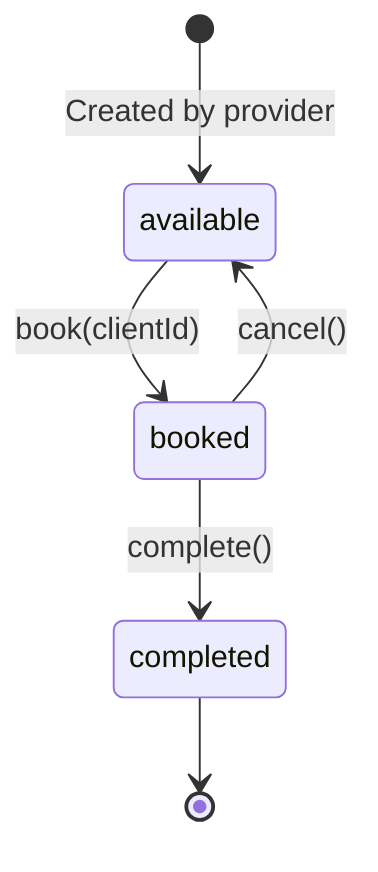

# Calendar Client Display & Selection Implementation

## Summary
Enhanced the calendar view to display client names for service providers and admins, and added comprehensive client management functionality including:
- Client assignment through autocomplete selector in timeslot details dialog
- Optional client assignment during timeslot creation
- Client reassignment for booked timeslots

## Timeslot State Diagram



Timeslots follow a simple state machine where booking assigns a client, cancellation makes them available again, and completion marks the appointment as fulfilled.

## Changes Made

### 1. Backend Changes

#### CalendarController.php
- **Added:** `User` model import
- **Added:** Client list retrieval for service providers and admins
  - Service providers get their linked clients
  - Admins get all clients in the system
- **Updated:** `index()` method to pass `clients` collection to the view

```php
// Service providers get their linked clients
if ($user->role === 'service_provider') {
    $clients = $user->clients()
        ->select('users.id', 'users.name')
        ->orderBy('users.name')
        ->get();
}
// Admins get all clients
elseif ($user->role === 'admin') {
    $clients = User::where('role', 'client')
        ->select('id', 'name')
        ->orderBy('name')
        ->get();
}
```

### 2. Frontend Components Created

#### Combobox Component (`resources/js/components/ui/combobox.tsx`)
- **Purpose:** Reusable autocomplete/searchable dropdown component
- **Features:**
  - Search/filter functionality
  - Keyboard navigation support
  - Clear search button
  - Custom placeholder and empty state messages
  - Disabled state support
- **Props:**
  - `options`: Array of `{value, label}` objects
  - `value`: Selected value
  - `onValueChange`: Selection handler
  - `placeholder`, `searchPlaceholder`, `emptyText`: Customization
  - `disabled`: Boolean flag

#### Popover Component (`resources/js/components/ui/popover.tsx`)
- **Purpose:** Radix UI Popover wrapper with Tailwind styling
- **Components:**
  - `Popover`: Root component
  - `PopoverTrigger`: Trigger element
  - `PopoverContent`: Content container with animations
  - `PopoverAnchor`: Anchor element

#### Command Component (`resources/js/components/ui/command.tsx`)
- **Purpose:** Command palette/search UI primitives (not used in final implementation)
- **Note:** Created for potential future use with `cmdk` package

### 3. Calendar Component Updates (`resources/js/pages/Calendar/Index.tsx`)

#### New Imports
```tsx
import { User as UserIcon } from 'lucide-react';
import { Combobox, type ComboboxOption } from '@/components/ui/combobox';
import type { Client } from '@/types/booking';
```

#### New State Variables
```tsx
const [selectedTimeslot, setSelectedTimeslot] = useState<Timeslot | null>(null);
const [selectedClientId, setSelectedClientId] = useState<number | null>(null);
const [isAssigning, setIsAssigning] = useState(false);
```

#### New Props
```tsx
interface CalendarPageProps extends SharedData {
    // ... existing props
    clients: Client[]; // NEW: List of clients for selector
}
```

#### New Handlers

**`handleAssignClient()`**
- Assigns selected client to available timeslot
- Uses existing `provider.timeslots.assign` route
- Shows loading state during assignment
- Resets dialog state on success

**`handleTimeslotClick(timeslot, date)`**
- Opens dialog with selected timeslot details
- Pre-fills client selector if timeslot is already booked
- Replaces generic `setSelectedDate` handler

**`handleDialogChange(open)`**
- Manages dialog open/close state
- Resets all selection state when dialog closes

#### Visual Updates

**Timeslot Cards (Calendar Grid)**
- **Added:** Client name display with User icon
  ```tsx
  {canSeeClientNames && timeslot.booking?.client && (
      <div className="flex items-center gap-1 text-xs text-muted-foreground mt-1 truncate">
          <UserIcon className="h-3 w-3 flex-shrink-0" />
          <span>{timeslot.booking.client.name}</span>
      </div>
  )}
  ```
- **Visible to:** Service providers and admins only
- **Styling:** Muted text color, truncates if too long, User icon prefix

**Timeslot Details Dialog**
- **Two modes:**
  1. **Single timeslot view** (when clicking a specific timeslot)
     - Shows detailed timeslot information
     - Client selector with autocomplete (for providers/admins)
     - "Assign Client" button (available timeslots only)
     - Shows current client (booked timeslots, read-only selector)
     - "Book Now" button (for clients)
  
  2. **List view** (when clicking empty day or day header)
     - Shows all timeslots for selected date
     - Quick "Assign"/"Book Now" buttons
     - Displays client names for booked slots

**Client Selector Implementation**
```tsx
<Combobox
    options={clients.map((client) => ({
        value: client.id,
        label: client.name,
    }))}
    value={selectedClientId || undefined}
    onValueChange={(value) => setSelectedClientId(value as number)}
    placeholder="Select a client..."
    searchPlaceholder="Search clients..."
    emptyText="No clients found."
    disabled={!selectedTimeslot.is_available}
/>
```

## User Experience Flow

### For Service Providers
1. **Calendar View:**
   - See all their own timeslots
   - Client names visible on booked timeslots (with User icon)
   - Provider name hidden (viewing own calendar)

2. **Assign Client:**
   - Click available timeslot
   - Search/select client from linked clients list
   - Click "Assign Client" button
   - Timeslot updates to "Booked" with client name

3. **View Booked Slot:**
   - Click booked timeslot
   - See which client has the booking
   - Client selector disabled (read-only view)

### For Admins
1. **Calendar View:**
   - See all timeslots from all providers
   - Client names visible on booked timeslots
   - Provider names visible on all timeslots

2. **Assign Client:**
   - Same flow as service providers
   - Can select from all clients in system (not just linked)

### For Clients
1. **Calendar View:**
   - See timeslots from linked providers
   - No client names visible (privacy)
   - Provider names visible

2. **Book Timeslot:**
   - Click available timeslot
   - Click "Book Now" button
   - No client selector shown

## Technical Details

### Permissions & Security
- Client assignment uses existing `provider.timeslots.assign` route
- Backend validates provider-client relationship
- Only available timeslots can be assigned
- Proper authorization checks in `TimeslotPolicy`

### Data Flow
```
CalendarController
  → Loads timeslots with 'booking.client' relationship
  → Loads clients for selector (role-specific)
  ↓
Calendar Component
  → Displays client names on cards (canSeeClientNames)
  → Opens dialog with timeslot details
  ↓
Combobox Component
  → User searches/selects client
  ↓
handleAssignClient()
  → Posts to provider.timeslots.assign
  → Backend creates Booking record
  → Calendar refreshes with updated data
```

### Type Safety
All components fully typed with TypeScript:
- `CalendarPageProps` interface extended with `clients`
- `ComboboxOption` interface for selector items
- `Client` type from `@/types/booking`
- Proper null checks for optional relationships

## Files Modified
1. `app/Http/Controllers/CalendarController.php` - Added client list retrieval
2. `resources/js/pages/Calendar/Index.tsx` - Main calendar component updates
3. `resources/js/components/ui/combobox.tsx` - NEW: Autocomplete selector
4. `resources/js/components/ui/popover.tsx` - NEW: Popover wrapper
5. `resources/js/components/ui/command.tsx` - NEW: Command primitives

## Testing Checklist
- [ ] Service provider sees client names on their booked timeslots
- [ ] Admin sees client names on all booked timeslots
- [ ] Clients do NOT see client names
- [ ] Client selector works with search/autocomplete
- [ ] Assign client to available timeslot succeeds
- [ ] Cannot assign to already booked timeslot
- [ ] Provider can only assign their linked clients
- [ ] Admin can assign any client
- [ ] Dialog resets state when closed
- [ ] Client names truncate properly on mobile
- [ ] Keyboard navigation works in combobox

## Recent Enhancements (December 2025)

### Create Timeslot Modal - Client Assignment
**Feature:** Service providers can now assign clients when creating timeslots

**Implementation:**
- Added `client_id` field to `createForm` state in Calendar/Index.tsx
- Added client selector dropdown to Create Timeslot modal
- Dropdown shows "Leave available" option (default) and list of linked clients
- Backend validates provider-client relationship via `StoreTimeslotRequest`
- If client assigned: timeslot created with `status='booked'` and `client_id` set
- If no client selected: timeslot created with `status='available'`

**UI Components:**
```tsx
<Select
    value={createForm.data.client_id ? String(createForm.data.client_id) : 'none'}
    onValueChange={(value) =>
        createForm.setData('client_id', value === 'none' ? null : parseInt(value))
    }
>
    <SelectTrigger id="client_id">
        <SelectValue placeholder="Leave available" />
    </SelectTrigger>
    <SelectContent>
        <SelectItem value="none">Leave available</SelectItem>
        {clients.map((client) => (
            <SelectItem key={client.id} value={String(client.id)}>
                {client.name}
            </SelectItem>
        ))}
    </SelectContent>
</Select>
```

**Backend Changes:**
1. `app/Http/Requests/StoreTimeslotRequest.php` - Added optional `client_id` validation
2. `app/Http/Controllers/Provider/TimeslotController.php` - Updated `store()` method to handle client assignment

**User Flow:**
1. Service provider clicks "+ Create Timeslot" button or clicks on a date
2. Modal opens with pre-filled date/time and client dropdown
3. Provider can either:
   - Leave "Leave available" selected → creates available timeslot
   - Select a client → creates booked timeslot with client assigned
4. Form submission creates timeslot with appropriate status and client_id

### Reassign Client Enhancement
**Feature:** Service providers can now reassign booked timeslots to different clients

**Implementation:**
- Removed `disabled={!selectedTimeslot.is_available}` prop from Reassign client Combobox
- Combobox now remains enabled for both available and booked timeslots
- Allows service providers to change client assignments on already-booked slots

**Before:**
```tsx
<Combobox
    // ... other props
    disabled={!selectedTimeslot.is_available}  // Disabled for booked slots
/>
```

**After:**
```tsx
<Combobox
    // ... other props
    // No disabled prop - always enabled for providers/admins
/>
```

**Benefits:**
- More flexibility in managing appointments
- Service providers can correct assignment mistakes
- Enables quick client swaps without cancelling and rebooking

### Delete Timeslot Authorization Enhancement (December 2025)
**Issue:** Need to provide different deletion capabilities based on page context and timeslot status

**Previous Behavior:**
- Calendar page used `route('provider.timeslots.destroy')` for provider deletion
- `Provider\TimeslotController::destroy()` used `forceDelete` authorization
- This allowed deletion of booked timeslots from calendar (unintended)

**New Implementation:**

#### Calendar Page (`/calendar`)
- **Available timeslots**: Show delete button with trash icon
- **Booked timeslots**: Hide delete button, show "Cancel Booking" and "Mark as Completed" instead
- Uses `provider.timeslots.destroy` route with `delete` policy
- Policy restricts deletion to available or cancelled timeslots only

**Controller Change:**
```php
// Provider\TimeslotController::destroy()
public function destroy(Timeslot $timeslot): RedirectResponse
{
    $this->authorize('delete', $timeslot);  // Changed from 'forceDelete'
    $timeslot->delete();
    return back()->with('success', 'Timeslot deleted successfully.');
}
```

#### Timeslots Page (`/timeslots`)
- **Available timeslots**: Show delete button with trash icon
- **Booked timeslots**: Show delete button (force delete)
- Available uses `provider.timeslots.destroy` route with `delete` policy
- Booked uses `timeslots.forceDelete` route with `forceDelete` policy
- Confirmation dialog adapts message based on timeslot status

**Frontend Implementation:**
```tsx
// Calendar/Index.tsx - Available timeslots only
{canSeeClientNames && selectedTimeslot.is_available && (
    <Button
        variant="outline"
        onClick={() => setShowDeleteDialog(true)}
        className="w-full text-destructive hover:text-destructive"
    >
        <Trash2 className="mr-2 h-4 w-4" />
        Delete Timeslot
    </Button>
)}

// Timeslots/Index.tsx - Both available and booked
const handleDeleteClick = (timeslotId: number, isAvailable: boolean = false) => {
    setSelectedTimeslot(timeslotId);
    setIsAvailableTimeslotDelete(isAvailable);
    setShowDeleteDialog(true);
};

const handleDeleteConfirm = () => {
    const deleteRoute = isAvailableTimeslotDelete
        ? route('provider.timeslots.destroy', selectedTimeslot)  // Regular delete
        : route('timeslots.forceDelete', selectedTimeslot);       // Force delete
    router.delete(deleteRoute, { /* ... */ });
};
```

**Policy Authorization:**
```php
// TimeslotPolicy::delete() - Available/cancelled only
public function delete(User $user, Timeslot $timeslot): bool
{
    // Only allow deletion of available or cancelled timeslots
    if ($timeslot->is_booked || $timeslot->is_completed) {
        return false;
    }
    return ($user->can('delete timeslots') && $user->id === $timeslot->provider_id) 
        || $user->isAdmin();
}

// TimeslotPolicy::forceDelete() - Any status
public function forceDelete(User $user, Timeslot $timeslot): bool
{
    // Provider can force delete their own timeslots (including booked ones)
    // Admin can force delete any timeslot
    return ($user->id === $timeslot->provider_id && $user->isServiceProvider())
        || $user->isAdmin();
}
```

**Result:**
- **Calendar page**: Clean UX - providers can only delete unbooked slots, use "Cancel Booking" for booked ones
- **Timeslots page**: Full control - providers can delete any of their timeslots
- **Authorization**: Proper enforcement through separate policies
- **User experience**: Contextual actions based on page and timeslot status

**Files Modified:**
1. `app/Http/Controllers/Provider/TimeslotController.php` - Changed authorization from `forceDelete` to `delete`
2. `resources/js/pages/Calendar/Index.tsx` - Removed delete button for booked timeslots
3. `resources/js/pages/Timeslots/Index.tsx` - Added conditional routing based on timeslot status
4. `app/Policies/TimeslotPolicy.php` - No changes (already had proper logic)

## Future Enhancements
- Add "Remove Client" button for booked timeslots
- Add bulk client assignment
- Add client details tooltip on hover
- Add recent clients quick-select
- Add client profile link from calendar
- Add client assignment history/audit log
