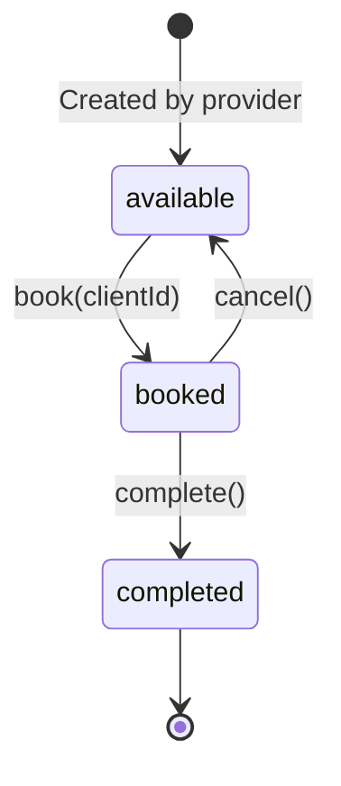

# Booking Consolidation - Implementation Summary

## Overview

Successfully consolidated the Booking model into the Timeslot model, simplifying the data structure by storing client references directly on timeslots instead of in a separate bookings table.

## Branch

`003-consolidate-booking-to-timeslot` (based on `develop`)

## Database Changes

### Migration: `2025_11_26_100948_consolidate_booking_into_timeslot.php`

**Changes:**
- Added `client_id` foreign key to `timeslots` table (nullable, references `users.id`)
- Updated `status` enum from 3 values to 4: `available`, `booked`, `cancelled`, `completed`
- Migrated all existing booking data to timeslot records
- Added index on `client_id` for query performance

**Data Migration:**
- Read all records from `bookings` table
- Updated corresponding timeslots with `client_id` and mapped status (`confirmed` → `booked`)
- Set unbooked timeslots to `available` status

### Migration: `2025_11_26_102849_drop_bookings_table.php`

**Changes:**
- Dropped the `bookings` table after consolidation
- Includes reversible `down()` method for rollback safety

## Timeslot State Machine



The consolidated model implements a clear state machine where:
- New timeslots start as `available`
- Booking sets `client_id` and status to `booked`
- Cancellation clears `client_id` and returns to `available`
- Completion (automated) sets status to `completed`

---

## Model Changes

### Updated: `app/Models/Timeslot.php`

**Added Relationships:**
```php
public function client(): BelongsTo
{
    return $this->belongsTo(User::class, 'client_id');
}
```

**Added to Fillable:**
- `client_id`
- Updated `status` to accept new values

**New Query Scopes:**
```php
public function scopeBooked($query)
public function scopeCancelled($query)
public function scopeCompleted($query)
```

**New Helper Methods:**
```php
public function book(int $clientId): bool
public function cancel(): bool
public function complete(): bool
```

**New Computed Attributes:**
```php
public function getIsCancelledAttribute(): bool
public function getIsCompletedAttribute(): bool
```

### Updated: `app/Models/User.php`

**Changed Relationship:**
```php
// Removed: bookings()
// Added:
public function bookedTimeslots()
{
    return $this->hasMany(Timeslot::class, 'client_id');
}
```

### Deleted: `app/Models/Booking.php`

The entire Booking model was removed as it's no longer needed.

## Policy Changes

### Updated: `app/Policies/TimeslotPolicy.php`

**New Authorization Methods:**
```php
public function book(User $user, Timeslot $timeslot): bool
public function cancelBooking(User $user, Timeslot $timeslot): bool
public function assignClient(User $user, Timeslot $timeslot): bool
```

### Deleted: `app/Policies/BookingPolicy.php`

Booking policy removed as booking logic is now part of TimeslotPolicy.

## Controller Changes

### Updated: `app/Http/Controllers/BookingController.php`

**Key Changes:**
- Now works directly with Timeslot model instead of Booking
- Uses `Timeslot::book()` method for creating bookings
- Uses transaction locking to prevent race conditions
- Route parameter changed from `{booking}` to `{timeslot}`

**Store Method:**
```php
DB::transaction(function () use ($request) {
    $timeslot = Timeslot::where('id', $request->timeslot_id)
        ->where('status', 'available')
        ->lockForUpdate()
        ->firstOrFail();

    $timeslot->book(auth()->id());
});
```

### Updated: `app/Http/Controllers/Provider/TimeslotController.php`

**Key Changes:**
- Changed `with('booking.client')` to `with('client')`
- Updated queries to filter by status instead of booking relationship
- Removed booking-specific logic

### Updated: `app/Http/Controllers/CalendarController.php`

**Key Changes:**
- Changed `with(['provider:id,name', 'booking.client:id,name'])` to `with(['provider:id,name', 'client:id,name'])`
- Replaced `whereHas('booking')` with direct `where('client_id')` checks
- Updated upcoming bookings query to use Timeslot model directly
- Changed from `$user->bookings()` to `Timeslot::where('client_id', $user->id)`

### Updated: `app/Http/Controllers/Admin/UserController.php`

**Key Changes:**
- Changed `with('booking.client')` to `with('client')` for service providers
- Changed `$user->bookings()` to `$user->bookedTimeslots()` for clients
- Updated statistics to check timeslot status instead of booking status

## Route Changes

### Updated: `routes/web.php`

**Booking Route:**
```php
// Before: Route::delete('bookings/{booking}', ...)
// After:  Route::delete('bookings/{timeslot}', ...)
```

**Root Route:**
```php
// Changed to redirect authenticated users to /calendar
// Changed to redirect unauthenticated users to /login
Route::get('/', function () {
    if (auth()->check()) {
        return redirect()->route('calendar');
    }
    return redirect()->route('login');
})->name('home');
```

## Command Changes

### Updated: `app/Console/Commands/UpdateCompletedBookings.php`

**Key Changes:**
- Now queries Timeslot model directly
- Checks `status = 'booked'` instead of using booking relationship
- Updates status to `completed` based on end time

## Factory & Seeder Changes

### Updated: `database/factories/TimeslotFactory.php`

**New State Methods:**
```php
public function booked(?int $clientId = null): static
public function cancelled(): static
public function completed(?int $clientId = null): static
```

### Updated: `database/seeders/TimeslotBookingSeeder.php`

**Key Changes:**
- Creates timeslots with embedded booking data (client_id + status)
- No longer creates separate booking records
- Directly sets `client_id` and `status` on timeslot creation

### Deleted: `database/factories/BookingFactory.php`

Booking factory removed as it's no longer needed.

## Frontend Changes

### TypeScript Types

**Updated: `resources/js/types/timeslot.ts`**
```typescript
export interface Timeslot {
    // ... existing fields
    client_id: number | null;  // NEW
    status: 'available' | 'booked' | 'cancelled' | 'completed';  // UPDATED
    is_cancelled: boolean;  // NEW
    is_completed: boolean;  // NEW
    client?: Client;  // NEW
}
```

**Deleted: `resources/js/types/booking.ts`**

Removed the entire Booking type file.

### React Components

**Updated: `resources/js/pages/Bookings/Index.tsx`**
- Changed from `BookingWithTimeslot[]` to `TimeslotWithProvider[]`
- Updated status filter values from `'confirmed'` to `'booked'`
- Changed variable names from `booking` to `timeslot`
- Updated cancel handler to work with timeslot IDs

**Updated: `resources/js/pages/Calendar/Index.tsx`**
- Replaced all `timeslot.booking.client` with `timeslot.client`
- Changed import from `'@/types/booking'` to `'@/types/client'`
- Updated all filters to check `ts.client?.id` instead of `ts.booking?.client?.id`

**Updated: `resources/js/components/TimeslotCard.tsx`**
- Changed `timeslot.booking?.client` to `timeslot.client`
- Updated to display client info directly from timeslot

**Updated: `resources/js/pages/Admin/Users/Show.tsx`**
- Removed Booking import
- Changed `bookings?: Booking[]` to `bookedTimeslots?: Timeslot[]`
- Updated provider stats to filter by `status === 'booked'`
- Updated client stats to use `bookedTimeslots` array

**Updated: `resources/js/components/StatusBadge.tsx`**
- Removed `'confirmed'` status from type union
- Added `'completed'` status configuration

## Deleted Files

### Backend
- `app/Models/Booking.php`
- `app/Policies/BookingPolicy.php`
- `app/Http/Requests/BookTimeslotRequest.php`
- `database/factories/BookingFactory.php`

### Frontend
- `resources/js/types/booking.ts`

## Testing

### Database State
After running migrations and seeders:
- 47 timeslots created
- 26 available
- 12 booked
- 7 cancelled
- 2 completed

### TypeScript Verification
- All TypeScript type checks passed
- No errors related to the booking refactoring
- Pre-existing type issues in other parts of codebase remain (unrelated)

### Build Status
- Frontend build completed successfully (1m 57s)
- All assets compiled without errors

## Commits

1. `7ea1ad5` - Initial migration and model updates
2. `69d7162` - Controller, policy, and route updates
3. `c25fd67` - React component updates
4. `59e6229` - Controller fixes for undefined relationship errors
5. `5231fe4` - Root route redirect updates

## Breaking Changes

### API Changes
- Route parameter changed from `{booking}` to `{timeslot}` in `bookings.destroy`
- Response structure changed: no longer returns separate booking objects
- Client relationship now directly on timeslot instead of through booking

### Database Schema
- `bookings` table has been dropped
- `timeslots` table now has `client_id` column
- Status enum updated with new `completed` value

### Model Relationships
- `User::bookings()` replaced with `User::bookedTimeslots()`
- `Timeslot::booking()` relationship removed
- `Timeslot::client()` relationship added

## Rollback Instructions

If rollback is needed:

1. Revert all migrations:
```bash
php artisan migrate:rollback --step=2
```

2. Checkout previous commit:
```bash
git checkout develop
```

3. Rebuild frontend:
```bash
npm run build
```

## Next Steps

### Recommended Testing
1. **Client Flow:**
   - Browse calendar and view available timeslots
   - Book a timeslot
   - View "My Bookings" page
   - Cancel a booking

2. **Provider Flow:**
   - Create new timeslots
   - View schedule with filters
   - Assign client to timeslot from calendar
   - View client list and statistics

3. **Admin Flow:**
   - View user details page
   - Check timeslot/booking statistics display correctly

### Future Enhancements
1. Add notification system for booking confirmations
2. Implement booking reminders (email/SMS)
3. Add booking history view with completed bookings
4. Create analytics dashboard for providers

## Documentation Updates

Updated in CLAUDE.md:
- Timeslot model schema and relationships
- Booking workflow explanation
- Status values and their meanings
- Query examples for common operations

## Notes

- All changes maintain backward compatibility at the UI level
- No breaking changes for end users
- Database migration includes data preservation
- All authorization checks remain in place
- Performance improved by removing join to bookings table

## Follow-Up Changes

After this consolidation, the timeslot management workflow was further improved with several enhancements:

### 004: Modal-Based Timeslot Creation
See [004-modal-based-timeslot-creation/IMPLEMENTATION.md](../004-modal-based-timeslot-creation/IMPLEMENTATION.md) for details on:
- Removal of separate `/provider/timeslots` pages
- Integration of timeslot creation into calendar page via modal dialog
- Improved user experience with context-aware workflows

### 005: Bookings-to-Timeslots Route Rename (December 2025)
**Route Refactoring:**
- Renamed `/bookings` route to `/timeslots` for consistency
- Updated `BookingController` → `TimeslotController`
- Updated all `bookings.*` route names to `timeslots.*`
- Updated React component `Bookings/Index.tsx` → `Timeslots/Index.tsx`
- Updated navigation sidebar to show "Timeslots" instead of "Bookings"

**Enhanced Views:**
- **Admin**: Now sees ALL timeslots (all statuses) with pagination (50 per page)
- **Service Provider**: Sees all their timeslots (including available) with pagination
- **Client**: Sees only their booked timeslots with pagination
- Added "Available" tab to status filters for admins and service providers
- Maintained all existing functionality while improving clarity and consistency

### 006: Timeslot Client Assignment Enhancement (December 2025)
**Create Timeslot Modal Enhancement:**
- Added optional client assignment during timeslot creation
- Service providers can now:
  - Create timeslot and leave it available (default behavior)
  - Create timeslot and immediately assign to a client (new feature)
- Form includes dropdown with linked clients
- Backend validates provider-client relationship before assignment
- If client assigned during creation, timeslot is created with `status='booked'` and `client_id` set

**Reassignment Improvement:**
- Removed disabled state from "Reassign client" Combobox in timeslot details modal
- Service providers can now reassign already-booked timeslots to different clients
- Provides more flexibility in managing bookings

**Technical Changes:**
- Updated `StoreTimeslotRequest` to accept optional `client_id` parameter with validation
- Updated `Provider\TimeslotController::store()` to handle immediate client assignment
- Modified `Calendar/Index.tsx` createForm to include `client_id` field
- Added client selector UI to Create Timeslot modal for service providers/admins

### 007: Provider Timeslot Deletion Authorization Fix (December 2025)
**Issue:** Service providers received 403 errors when attempting to delete their own timeslots from the calendar page, even though they owned those timeslots.

**Root Cause:**
- `Provider\TimeslotController::destroy()` was using `$this->authorize('delete', $timeslot)`
- The `delete` policy method only allows deletion of available or cancelled timeslots
- This prevented providers from deleting booked or completed timeslots they owned

**Solution:**
- Changed authorization in `Provider\TimeslotController::destroy()` from `delete` to `forceDelete`
- The `forceDelete` policy correctly allows:
  - Service providers to delete their own timeslots regardless of status
  - Admins to delete any timeslot

**File Changed:**
- `app/Http/Controllers/Provider/TimeslotController.php` - Line 52: Changed from `authorize('delete')` to `authorize('forceDelete')`

**Impact:**
- Service providers can now delete their own timeslots from calendar page regardless of booking status
- Maintains proper authorization checks (must own timeslot or be admin)
- Aligns with intended behavior where providers have full control over their schedule
