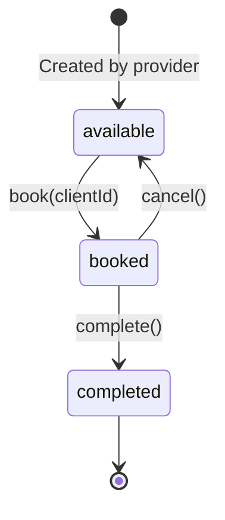

# Unified Feature Specification: Bookspot - Timeslot Booking Management System

**Project**: Bookspot  
**Created**: 2025-11-22  
**Last Updated**: 2025-12-10
**Status**: Active
**Version**: 2.3.0

**Consolidated From**:
- 001-timeslot-booking (Core booking system)
- 002-client-provider-link (Client-provider relationships)
- 003-consolidate-booking-to-timeslot (Data model simplification)
- 004-modal-based-timeslot-creation (UX improvements)
- 005-bookings-to-timeslots-rename (Route and UI refactoring)
- 006-timeslot-client-assignment (Enhanced creation workflow)
- 007-provider-delete-authorization-fix (Bug fix for calendar deletion)
- 008-available-timeslot-deletion (Enhanced deletion for available timeslots)
- 009-timeslot-duration-editing (Edit duration for available timeslots from calendar)

---

## Overview

Bookspot is a timeslot booking management system with three user roles:
1. **Admin** - User management, can act on behalf of ServiceProviders
2. **ServiceProvider** - Creates available timeslots, manages client relationships, assigns/cancels bookings
3. **Client** - Books/cancels timeslots from linked providers

---

## User Stories

### Core Booking (Priority: P1)

#### US-1: Client Books Available Timeslot

A client views available timeslots in the calendar and books a slot that fits their schedule.

**Acceptance Scenarios**:
1. **Given** a client is logged in and viewing the calendar, **When** they select a day with available slots and click "Book", **Then** the system reserves that slot for them and shows a confirmation
2. **Given** a client has booked a timeslot, **When** they view their bookings list, **Then** they see the booked slot with service provider details, date, and time
3. **Given** a timeslot has been booked by one client, **When** another client views the calendar, **Then** that slot appears as booked
4. **Given** a client has a confirmed booking within 3 days, **When** they visit the calendar page, **Then** they see a flash notification message with appointment details
5. **Given** a client views the calendar, **When** the page loads, **Then** they only see timeslots starting from the current time onwards (no past timeslots)

---

#### US-2: Service Provider Creates Available Timeslots

A service provider defines their availability by creating timeslots via a modal dialog on the calendar page, with optional immediate client assignment.

**Acceptance Scenarios**:
1. **Given** a service provider is logged in on the calendar, **When** they click "+ Create Timeslot" or click on a date, **Then** a modal opens with date, start time, duration, and optional client assignment fields
2. **Given** a service provider fills out the timeslot form without selecting a client, **When** they submit, **Then** the slot is saved as "available" and appears immediately in the calendar
3. **Given** a service provider selects a client during timeslot creation, **When** they submit, **Then** the slot is saved as "booked" with the assigned client
4. **Given** a service provider creates overlapping timeslots, **When** they attempt to save, **Then** the system prevents the creation and shows a validation error
5. **Given** a service provider creates a timeslot in the past, **When** they attempt to save, **Then** the system prevents the creation and shows a validation error
6. **Given** a service provider tries to assign a client they are not linked to, **When** they attempt to save, **Then** the system shows a validation error

---

#### US-3: Service Provider Creates Client Account

A service provider creates a new client account, and the system automatically establishes a relationship between them.

**Acceptance Scenarios**:
1. **Given** a service provider is logged in, **When** they create a new client account with name and email, **Then** the system creates the client and automatically links them to this provider
2. **Given** a service provider has created a client, **When** they view their client list, **Then** they see the newly created client with their contact information
3. **Given** a service provider creates a client that already exists in the system, **When** the system detects the existing email, **Then** it establishes a relationship without creating a duplicate account
4. **Given** a client account is created by a service provider, **When** the client logs in, **Then** they can see timeslots from their linked provider(s)

---

#### US-4: Service Provider Views Their Client List

A service provider can view all clients they have created or are linked to.

**Acceptance Scenarios**:
1. **Given** a service provider has multiple clients, **When** they access the clients page, **Then** they see a list of all their linked clients with names and email addresses
2. **Given** a service provider views their client list, **When** they search for a specific client, **Then** the list filters to show matching results
3. **Given** a service provider has no clients yet, **When** they access the clients page, **Then** they see an empty state with a prompt to create their first client

---

### Management Features (Priority: P2)

#### US-5: Service Provider Manages Bookings

A service provider can manually add clients to timeslots, reassign clients, cancel timeslots, remove client bookings, delete available timeslots, and edit timeslot durations.

**Acceptance Scenarios**:
1. **Given** a service provider views an available timeslot, **When** they manually assign a client to that slot, **Then** the slot is marked as booked for that client
2. **Given** a service provider views a booked timeslot, **When** they reassign it to a different client, **Then** the slot is updated with the new client assignment
3. **Given** a service provider views a booked timeslot, **When** they remove the client's booking, **Then** the slot becomes available again
4. **Given** a service provider views an available timeslot on the calendar, **When** they click delete, **Then** the available timeslot is permanently removed from their schedule
5. **Given** a service provider views an available timeslot on the timeslots page, **When** they click delete, **Then** the available timeslot is permanently removed from their schedule
6. **Given** a service provider views a booked timeslot, **When** they click delete on the timeslots page, **Then** the timeslot is permanently removed including the client booking
7. **Given** a service provider views an available timeslot in the calendar details modal, **When** they click the edit icon next to duration and select a new duration, **Then** the timeslot duration is updated if it doesn't create overlaps
8. **Given** a service provider attempts to edit an available timeslot's duration, **When** the new duration would overlap with another timeslot, **Then** the system prevents the update and shows a validation error
9. **Given** a service provider views a booked timeslot, **When** they try to edit the duration, **Then** the edit option is not available (duration is read-only for booked slots)

---

#### US-6: Client Cancels Booking

A client can cancel their booking if they can no longer make the appointment.

**Acceptance Scenarios**:
1. **Given** a client has a booked timeslot, **When** they click "Cancel Booking", **Then** the booking is removed and the slot becomes available again
2. **Given** a client cancels their booking, **When** other clients view available timeslots, **Then** the canceled slot appears as available
3. **Given** a client tries to cancel a timeslot that starts in less than 24 hours, **When** they attempt to cancel, **Then** the system shows a warning but still allows cancellation

---

#### US-7: Client Belongs to Multiple Providers

A client can be linked to multiple service providers.

**Acceptance Scenarios**:
1. **Given** a client is linked to Provider A, **When** Provider B adds the same client by email, **Then** the client is linked to both providers without account duplication
2. **Given** a client is linked to multiple providers, **When** they view available timeslots in the calendar, **Then** they see slots from all their linked providers
3. **Given** a client is linked to multiple providers, **When** they view their profile, **Then** they see a list of all service providers they are connected to

---

#### US-8: Service Provider Manages Client Relationships

A service provider can remove a client from their list.

**Acceptance Scenarios**:
1. **Given** a service provider has a client in their list, **When** they remove the client relationship, **Then** the client no longer appears in their client list
2. **Given** a provider removes a client relationship, **When** the client logs in, **Then** they can no longer see or book that provider's timeslots
3. **Given** a provider removes a client with future bookings, **When** they attempt the removal, **Then** the system requires confirmation and cancels all future bookings with that provider

---

### Admin Features (Priority: P3)

#### US-9: Admin Manages Users

An admin can create, update, and delete user accounts, and assign roles.

**Acceptance Scenarios**:
1. **Given** an admin is logged in, **When** they create a new user with role "ServiceProvider", **Then** that user can log in and access provider features
2. **Given** an admin views the users list, **When** they see all users, **Then** each user displays their name, email, role, and status
3. **Given** an admin deletes a user, **When** that user tries to log in, **Then** they see an "account not found" error

---

#### US-10: Admin Acts on Behalf of Service Provider

An admin can perform any service provider action on behalf of any provider.

**Acceptance Scenarios**:
1. **Given** an admin is logged in, **When** they select "Act as Provider" for a specific service provider, **Then** they see that provider's dashboard and can perform all provider actions
2. **Given** an admin is acting on behalf of a provider, **When** they create a timeslot, **Then** the slot is associated with the selected provider, not the admin

---

## Edge Cases

### Booking Edge Cases
- **Race condition**: When a client tries to book a slot that was just booked by another client, the system detects the conflict and shows an error message
- **Timezone handling**: System operates in a single timezone (server timezone). Multi-timezone support is out of scope
- **Recurring timeslots**: Out of scope for MVP. Only one-off timeslots are supported
- **Modifying booked slots**: System prevents modification of booked slots

### Relationship Edge Cases
- **Email conflicts**: When a client is created with an email that matches an existing admin or service provider, system prevents role conflicts
- **No provider relationships**: Client can still log in but sees no available timeslots until linked to at least one provider
- **Provider deletion with clients**: Clients remain in the system but lose that provider relationship

### Notification Edge Cases
- **Booking confirmations/cancellations**: Email notifications + in-app flash messages. SMS is out of scope

---

## Functional Requirements

### Authentication & Authorization
- **FR-001**: System MUST support three distinct user roles: Admin, ServiceProvider, and Client
- **FR-002**: System MUST authenticate users via email and password
- **FR-003**: System MUST restrict feature access based on user roles (RBAC)
- **FR-004**: Admin users MUST be able to perform all actions available to ServiceProviders
- **FR-005**: Users MUST be able to reset their password via email link

### Timeslot Management
- **FR-006**: ServiceProviders MUST be able to create timeslots via modal dialog on calendar page with optional client assignment
- **FR-007**: ServiceProviders MUST be able to view all their created timeslots in the calendar and /timeslots page
- **FR-008**: ServiceProviders MUST be able to delete available timeslots from both calendar and timeslots pages
- **FR-009**: ServiceProviders MUST be able to delete booked timeslots from the timeslots page only (not from calendar)
- **FR-010**: ServiceProviders MUST be able to manually assign a client to an available timeslot
- **FR-011**: ServiceProviders MUST be able to reassign a booked timeslot to a different client
- **FR-012**: ServiceProviders MUST be able to remove a client's booking
- **FR-013**: System MUST prevent overlapping timeslots for the same provider
- **FR-014**: System MUST prevent timeslots in the past
- **FR-015**: System MUST validate provider-client relationships during timeslot assignment
- **FR-016**: ServiceProviders MUST be able to edit the duration of available timeslots from the calendar details modal
- **FR-017**: System MUST prevent editing duration of booked, cancelled, or completed timeslots
- **FR-018**: System MUST validate that duration changes do not create overlaps with existing timeslots

### Booking Management
- **FR-019**: Clients MUST see timeslots only from their linked service providers
- **FR-020**: Clients MUST be able to book an available timeslot from the calendar
- **FR-021**: Clients MUST be able to view their own booked timeslots on /timeslots page
- **FR-022**: Clients MUST be able to cancel their own bookings
- **FR-023**: System MUST prevent double-booking (atomic operations with locking)
- **FR-024**: System MUST prevent clients from booking overlapping timeslots

### Client-Provider Relationships
- **FR-025**: ServiceProviders MUST be able to create new client accounts with name, email, and optional phone
- **FR-026**: System MUST automatically establish provider-client relationship when a provider creates a client
- **FR-027**: System MUST allow a client to be linked to multiple providers
- **FR-028**: System MUST prevent duplicate client accounts (email is unique identifier)
- **FR-029**: ServiceProviders MUST be able to view their linked clients list
- **FR-030**: System MUST send email notifications to newly created clients with credentials
- **FR-031**: Clients MUST be able to view which providers they are linked to
- **FR-032**: ServiceProviders MUST be able to remove a client relationship (with cascade to future bookings)

### User Management (Admin)
- **FR-033**: Admins MUST be able to create new user accounts with assigned roles
- **FR-034**: Admins MUST be able to view a list of all users with their roles
- **FR-035**: Admins MUST be able to update user roles
- **FR-036**: Admins MUST be able to delete user accounts (with safeguards)
- **FR-037**: Admins MUST be able to view all timeslots from all providers on /timeslots page
- **FR-038**: Admins MUST be able to act on behalf of any ServiceProvider

### Data Integrity
- **FR-039**: System MUST ensure atomic booking operations (no race conditions)
- **FR-040**: System MUST maintain referential integrity between users, timeslots, and relationships
- **FR-041**: System MUST prevent deletion of accounts with future active bookings
- **FR-042**: System MUST log all booking and relationship changes with timestamps

### Automated Processes
- **FR-043**: System MUST automatically mark timeslots as 'completed' after their end time (hourly task)
- **FR-044**: Clients MUST see only future timeslots in the calendar view
- **FR-045**: Clients MUST receive flash notifications for confirmed bookings within 3 days

### Timeslots Page
- **FR-046**: All authenticated users MUST be able to view /timeslots page with role-based filtering
- **FR-047**: Admins MUST see all timeslots (all statuses) with pagination (50 per page)
- **FR-048**: ServiceProviders MUST see all their timeslots (all statuses) with pagination (50 per page)
- **FR-049**: Clients MUST see only their booked timeslots with pagination (50 per page)
- **FR-050**: All users MUST be able to filter timeslots by status (all, available, booked, cancelled, completed)
- **FR-051**: All users MUST be able to filter timeslots by date
- **FR-052**: ServiceProviders MUST be able to filter timeslots by client
- **FR-053**: ServiceProviders MUST be able to delete available timeslots from the timeslots page
- **FR-054**: ServiceProviders MUST be able to delete booked timeslots from the timeslots page (force delete)

---

## Data Model

### User
- id, name, email, password (hashed), role (Admin/ServiceProvider/Client), timezone
- Relationships: hasMany(Timeslot) as provider, hasMany(Timeslot) as client (bookedTimeslots)

### Timeslot
- id, provider_id (FK→users), client_id (FK→users, nullable), start_time, duration_minutes, status
- Status values: `available`, `booked`, `cancelled`, `completed`
- Relationships: belongsTo(User) as provider, belongsTo(User) as client
- **Note**: Booking entity has been consolidated into Timeslot (client_id stored directly)

### ProviderClient (Pivot)
- id, provider_id (FK→users), client_id (FK→users), created_at, created_by_provider, status
- Unique constraint on (provider_id, client_id)
- Relationships: belongsTo(User) as provider, belongsTo(User) as client

---

## Primary Interfaces

### Calendar Page (Primary Interface)

- **Unified Route**: Single `/calendar` route for all authenticated users
- **Role-Agnostic Interface**: Same calendar displayed to all roles; actions controlled by permissions
- **Modal-Based Operations**: Timeslot creation/management via modal dialogs (no separate pages)
- **Client Assignment**: Service providers can assign clients during timeslot creation
- **Reassignment**: Service providers can reassign booked timeslots to different clients
- **Client Filtering**: Clients see only future timeslots from linked providers
- **Provider Filtering**: Providers/admins see timeslots from yesterday onwards
- **Upcoming Alerts**: Flash notifications for bookings within 3 days
- **Status Indicators**: Available (green), Booked (blue), Cancelled (hidden)
- **Persistent View State**: Calendar remembers selected month across sessions

### Timeslots Page (List View)

- **Route**: `/timeslots` - Available to all authenticated users
- **Admin View**: All timeslots from all providers (all statuses) with provider column
- **Service Provider View**: All their own timeslots (all statuses) with "Available" tab
- **Client View**: Only their booked timeslots (booked, cancelled, completed)
- **Pagination**: 50 items per page
- **Filters**: Status tabs (all, available*, booked, cancelled, completed), date picker, client selector*
  - *Available tab: Shown to admins and service providers only
  - *Client selector: Service providers only
- **Actions**:
  - **Service Providers**: Delete available timeslots, delete booked timeslots (force delete), cancel booking, mark complete
  - **Clients**: Cancel their own bookings
  - All actions are role-based with proper authorization

---

## Timeslot Status Lifecycle



**Status Transitions:**
- `available` → `booked` - Client assigned via booking
- `booked` → `available` - Manually cancelled by client or provider
- `booked` → `completed` - Automatically after end_time passes
- `available` → `cancelled` - Provider cancels empty slot (removes timeslot)

**Automated Status Management**: Hourly scheduled task updates all `booked` timeslots to `completed` after their end_time.

---

## Success Criteria

### Performance
- **SC-001**: Clients can book a timeslot in under 60 seconds from login
- **SC-002**: Providers can create 20+ timeslots in under 5 minutes
- **SC-003**: System prevents double-booking 100% of the time
- **SC-004**: 95% of user actions complete within 2 seconds

### Usability
- **SC-005**: Users complete primary tasks on first attempt without documentation
- **SC-006**: Providers can create a client and link in under 30 seconds
- **SC-007**: Clients can view all linked providers' timeslots in unified calendar

### Data Quality
- **SC-008**: System prevents duplicate client accounts 100% of the time
- **SC-009**: Complete audit trail of all booking and relationship changes

---

## Assumptions

1. Single service per provider (no multi-service pricing)
2. Same-day booking allowed
3. No payment processing
4. English language only
5. Web-based interface (responsive)
6. Email notifications (no SMS)
7. Single timezone for MVP
8. Admin-created users only (no self-registration)
9. Email is unique identifier for clients

---

## Out of Scope

- Payment processing or pricing
- Calendar integrations (Google Calendar, Outlook)
- Recurring timeslot templates
- Waitlist functionality
- Review/rating system
- Multi-language support
- SMS notifications
- Video conferencing integration
- Resource management (rooms, equipment)
- Group bookings
- Self-service user registration
- Client approval/invitation workflows
- Provider-client messaging
- Detailed client profile management
- Client groups/categorization
- Import/export of client lists

---

## Architecture Notes

### Booking Consolidation (from 003)
The original Booking entity has been consolidated into the Timeslot model. Instead of a separate `bookings` table, the `timeslots` table now includes:
- `client_id` (nullable FK to users)
- Updated `status` enum: available, booked, cancelled, completed

This simplifies queries and reduces joins while maintaining all functionality.

### Modal-Based UX (from 004)
Timeslot management has been refactored from separate pages to modal dialogs:
- Removed: `/provider/timeslots` and `/provider/timeslots/create` routes
- Added: Modal dialog on `/calendar` for creating timeslots
- All operations redirect back to `/calendar` to maintain context

### Available Timeslot Deletion (from 008)
Service providers can now delete timeslots with different authorization levels based on context:

**Calendar Page (`/calendar`):**
- Service providers can delete **available timeslots only**
- Delete button shown only for timeslots with `status='available'`
- Uses `provider.timeslots.destroy` route with `delete` policy authorization
- Policy prevents deletion of booked or completed timeslots
- Booked timeslots show "Cancel Booking" instead (makes available again)

**Timeslots Page (`/timeslots`):**
- Service providers can delete **both available and booked timeslots**
- Available timeslots: Use `provider.timeslots.destroy` route with `delete` policy
- Booked timeslots: Use `timeslots.forceDelete` route with `forceDelete` policy
- Confirmation dialog text adapts based on timeslot status
- Available deletion: "Remove from schedule"
- Booked deletion: "Remove including client booking"

**Authorization Logic:**
```php
// TimeslotPolicy::delete() - For available/cancelled only
public function delete(User $user, Timeslot $timeslot): bool
{
    if ($timeslot->is_booked || $timeslot->is_completed) {
        return false;
    }
    return ($user->can('delete timeslots') && $user->id === $timeslot->provider_id) 
        || $user->isAdmin();
}

// TimeslotPolicy::forceDelete() - For any status including booked
public function forceDelete(User $user, Timeslot $timeslot): bool
{
    return ($user->id === $timeslot->provider_id && $user->isServiceProvider())
        || $user->isAdmin();
}
```

**Routes:**
- `DELETE /provider/timeslots/{timeslot}` - Regular delete (available only)
- `DELETE /timeslots/{timeslot}/force-delete` - Force delete (any status)

---

## Related Documents

- `plan.md` - Implementation plan with technical context
- `tasks.md` - Task breakdown for implementation
- `data-model.md` - Detailed database schema
- `IMPLEMENTATION.md` files in 003/ and 004/ - Architectural change details
